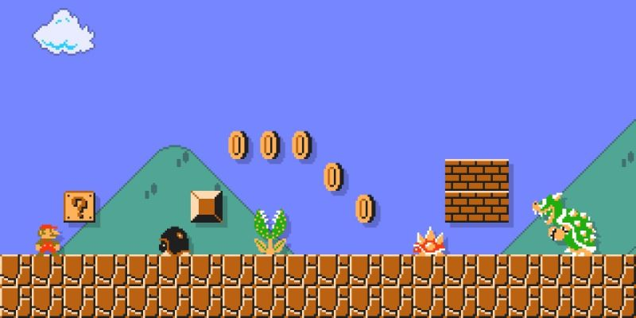

# 002 - SuperMario



Princess Peach is kidnapped again by Bowser! Help Mario to save her.

## The task

Write a function with the following signature:

```javascript
function play(storyboard) {}
```

The `storyboard` is a string, containing a space-separated list of simple Super Mario game objects, describing a game. You have to process it and you have to check if the player wins or not.

1. If Mario **reaches Bowser or Princess without dying**, return with the string `WIN`
2. If Mario **dies**, return with the string `GAME OVER` 
3. If `storyboard` describes an **incomplete game**, return with `???`

A game is **incomplete** when Mario is still alive by the end, but did not reach Bowser or Princess.


### Rules

The storyboard consists of 
* enemies, 
* coins (positive integers), 
* bonus objects that can be picked up and 
* goals
separated by one or more spaces. 

Mario initially has **3 lifes, 0 coins and is in Small mode**. When all 3 lifes are lost, Mario dies and the game ends.

### Enemies

Sometimes Mario hurt his leg, and cannot jump over the enemies. When he walks into them, he is losing a life. 
If he is in Super mode (see _Bonuses_), instead of losing a life, he turns back into Small Mario. 
The following enemies can be found in the storyboard:
```
goomba
koopa
piranha
```

### Coins

All positive numbers represent the same amount of coins. Every 100 coin grants Mario an extra life.

### Bonuses

Bonus objects grant Mario special abilities.

- `Mushroom` turns Small Mario into Super Mario
- `Star` grants invulnerability for the next **two steps**.
- `1Up` gives Mario an extra life

### Goals

When Mario reaches `Bowser` or `Princess`, the game is won.
> Note: they may not be at the end of the storyboard


## Example Test-Cases

> Note: you can find a bigger set of test cases in [002-supermario-test-input.json](../resources/002-supermario-test-input.json)

1. `piranha Princess piranha` => `WIN`
2. `1Up koopa goomba piranha Bowser` => `WIN`
3. `Star Mushroom  piranha goomba piranha goomba Princess` => `WIN`
4. ` piranha piranha piranha piranha` => `GAME OVER`
5. `piranha piranha Star goomba goomba Princess` => `WIN`
6. `10 40 koopa goomba 20 30 piranha piranha` => `GAME OVER`
