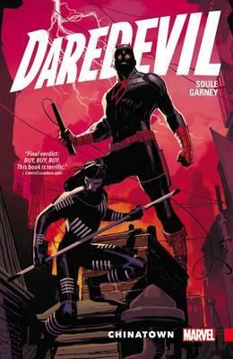
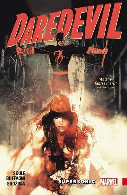
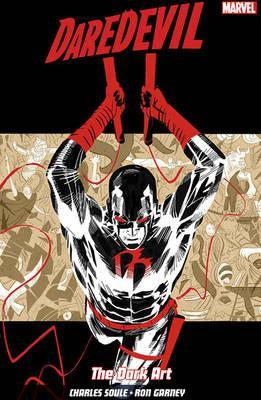
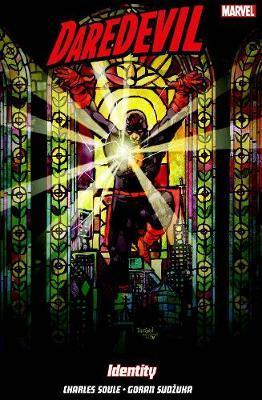
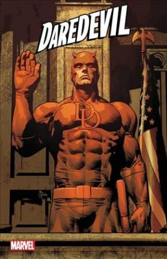

# Comics Discount

## The task

Daredevil comics has reached the end of a big story arch - its title is **"Back in Black"**

THere is 5 paperback collection of the single comic book issues available currently on the market:

1. Chinatown
2. Supersonic
3. The Dark Art
4. Identity
5. Supreme







**Marvel Comics** decided to offer a special pricing model to give collectors better chances of getting their favourite series cheaper.

- **One copy** of any of the five books costs **8 EUR.**
- If, however, you buy **two different books** from the series, you get a **5% discount** on those two books.
- If you buy **3 different books**, you get a **10% discount**.
- With **4 different books**, you get a **20% discount**.
- If you go the whole hog, and **buy all 5**, you get a huge **25% discount**.

> Note that if you buy four books, of which 3 are different titles,
you get a 10% discount on the 3 that form part of a set, but the fourth
book still costs the full 8 EUR.</p>

Comics mania is sweeping the country and fans are queueing up with shopping baskets overflowing with Daredevil comic books.
**Your mission is to write a piece of code to calculate the price of any
conceivable shopping basket, giving as big a discount as possible.**

<p>For example, how much does this basket of books cost?</p>

- 2 copies of the first book
- 2 copies of the second book
- 2 copies of the third book
- 1 copy of the fourth book
- 1 copy of the fifth book

answer:
```
  (4 * 8) - 20% [first book, seconde book, third book, fourth book]
+ (4 * 8) - 20% [first book, seconde book, third book, fifth book]
= 25.6 * 2
= 51.20
```

## Clues

You’ll find that this Kata is easy at the start. You can get going with
tests for baskets of 0 books, 1 book, 2 identical books, 2 different
books… and it is not too difficult to work in small steps and gradually
introduce complexity.

However, the twist becomes apparent when you sit down and work out how
much you think the sample basket above should cost. It isn’t
<code>5 * 8 * 0.75 + 3 *8 * 0.90</code>. It is in fact <code>4 * 8 * 0.8 + 4 * 8 * 0.8</code>. So the trick
with this Kata is not that the acceptance test you’ve been given is
wrong. The trick is that you have to write some code that is intelligent
enough to notice that two sets of four books is cheaper than a set of
five and a set of three.

**You will have to introduce a certain amount of clever optimization
algorithm. But not too much! This problem does not require a fully
fledged general purpose optimizer. Trust that you
can generalize and improve your solution if and when new requirements
come along.**


<h2 id="suggested-test-cases">Suggested Test Cases</h2>

```
No Discount
Result             Books
  0,                []
  8,                [0]
  8,                [1]
  8,                [2]
  8,                [3]
  8,                [4]
  8 * 2,            [0, 0]
  8 * 3,            [1, 1, 1]

Discounts
  8 * 2 * 0.95,         [0, 1]
  8 * 3 * 0.9,          [0, 2, 4]
  8 * 4 * 0.8,          [0, 1, 2, 4]
  8 * 5 * 0.75,         [0, 1, 2, 3, 4]

Several Discounts
  8 + (8 * 2 * 0.95),               [0, 0, 1]
  2 * (8 * 2 * 0.95),               [0, 0, 1, 1]
  (8 * 4 * 0.8) + (8 * 2 * 0.95),   [0, 0, 1, 2, 2, 3]
  8 + (8 * 5 * 0.75),               [0, 1, 1, 2, 3, 4]


Edge Cases
  2 * (8 * 4 * 0.8),            [0, 0, 1, 1, 2, 2, 3, 4]
  3 * (8 * 5 * 0.75) + 2 * (8 * 4 * 0.8),   [0, 0, 0, 0, 0,
                                             1, 1, 1, 1, 1,
                                             2, 2, 2, 2,
                                             3, 3, 3, 3, 3,
                                             4, 4, 4, 4]
end
```